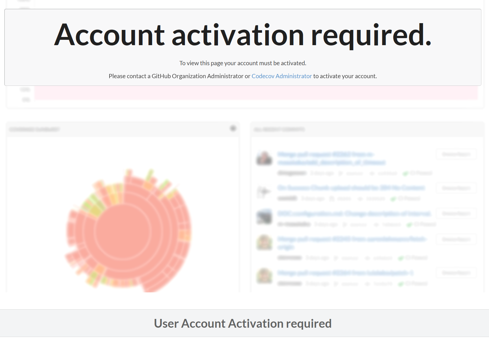
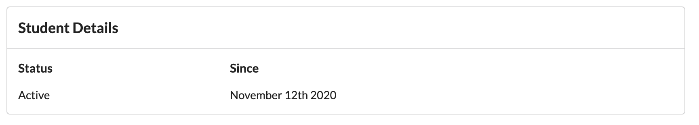
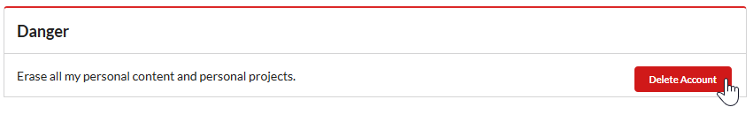
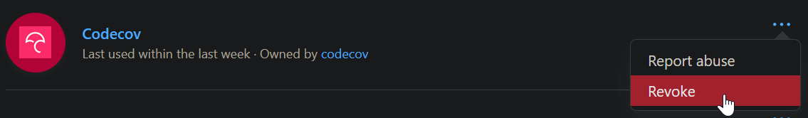
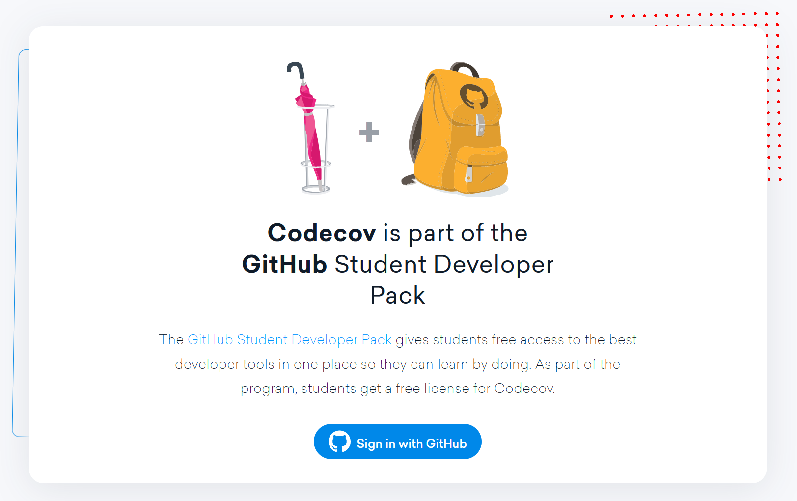

### CodeCov Errors

If you see an error like the one below:

First, ensure that you are a student. If you are, in your CodeCov Personal Settings, you should see a box similar to

If you do, go to [https://codecov.io/account/gh/cs169/users](https://codecov.io/account/gh/cs169/users), find your name in the list of all users below, and Click the green `Activate` button next to your username. If you see your name and it is not already active and the Activate button is grayed out, check if you have a blue `Student` tag in your row in the table. If you don't, you aren't a student, so follow the steps below. If you can click Activate, once you have done so, navigate back to your project page and you should no longer see the above error.

#### If you are not a student:

First, [make sure your GitHub account is under the education plan](https://github.blog/2019-07-30-how-to-get-the-github-student-developer-pack-without-a-student-id/#:~:text=Visit%20GitHub%20Education%20and%20click,select%20(or%20add%20it). If it isn't, follow those instructions to add your berkeley.edu email to your account, and you will be able to get approved automatically.

Once you have done that, head over to CodeCov > Personal Settings, and delete your CodeCov account.

Then, clear CodeCov's browser storage data (Instructions for [Safari](https://support.apple.com/guide/safari/manage-cookies-and-website-data-sfri11471/mac), [Chrome](https://support.google.com/chrome/answer/95647), and [FireFox](https://support.mozilla.org/en-US/kb/clear-cookies-and-site-data-firefox)). Follow the instructions for clearing cookies from a specific site, so that it does not erase all website data.

Go to [https://github.com/settings/applications](https://github.com/settings/applications) and revoke Codecov's access.

Then, Go to [https://codecov.io/students](https://codecov.io/students) and click the blue Sign in with GitHub button.

Now, check your CodeCov account's Personal Settings, and you should be a student. Go back to the top of this document, and follow the instructions to activate your account in the cs169 organization on CodeCov.
